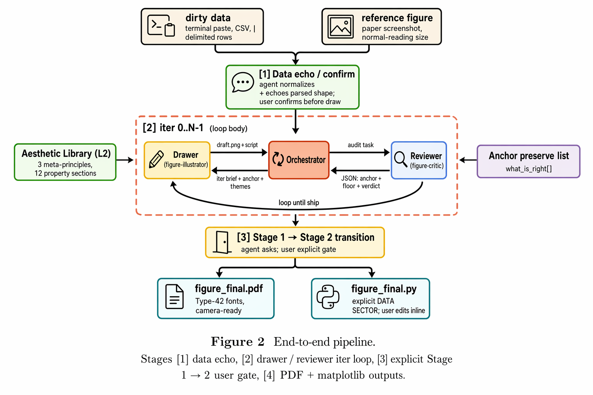
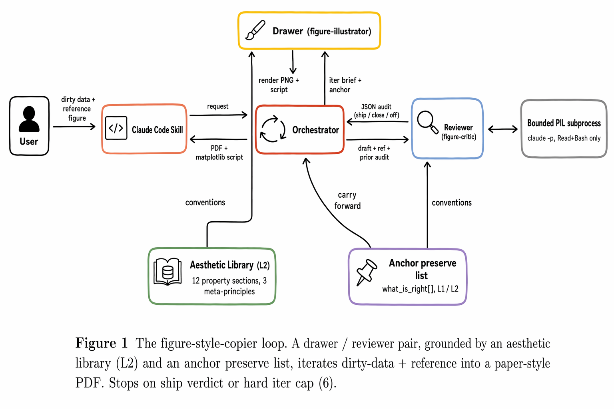

# FigMirror Method

FigMirror turns a paper-figure screenshot into a style anchor for new data. The core idea is simple: render a draft, compare it to the reference, preserve what is already right, and repeat until the figure clears both style and quality checks.

## Input Contract

FigMirror works best for the median paper-writing workflow:

- A reference figure screenshot at normal reading size. Cropped or uncropped is fine; Stage 0 cleans margins, captions, and neighboring panels when safe.
- User data in a parseable form: CSV, TSV, markdown table, or dirty terminal paste.
- A run workspace where iteration artifacts can be written.

The output is a self-contained matplotlib script plus PNG and PDF renders. The final PDF is configured with type-42 fonts for LaTeX submission workflows.

## Loop

<p align="center">
  
</p>

Each run has four stages:

1. **Data echo and confirmation.** The agent normalizes the paste, reports rows, columns, missing values, and a sample row, then records the parse in `data_echo.md`.
2. **Drawer / Reviewer iterations.** The Drawer writes matplotlib code and renders `img_iter<N>.png`. The Reviewer audits a fresh view containing only the reference, draft, aesthetic library, and prior audit.
3. **User gate.** When style transfer is good enough, the run can move from style matching into detail-level tweaks.
4. **Final export.** The chosen iteration becomes `figure.py`, `figure.png`, and `figure.pdf`.

## Architecture

<p align="center">
  
</p>

FigMirror is packaged as prompt assets plus lightweight Python runners:

| Layer | Where it lives | Role |
|---|---|---|
| Drawer | `.codex/skills/figmirror/references/drawer.md` and Claude skill equivalents | Writes matplotlib code and draft images. |
| Reviewer | `.codex/skills/figmirror/references/reviewer.md` and Claude skill equivalents | Performs fresh-context visual audits and emits strict JSON. |
| Orchestrator | `.codex/skills/figmirror/references/orchestrator-codex.md` and runner code | Applies stop rules, carries anchors, and finalizes outputs. |
| Aesthetic library | `references/aesthetic-library.md` in each skill bundle | Stores reusable paper-figure conventions. |
| 3D insert | `.codex/skills/figmirror/references/three-d-prompting.md` and `references/three-d/*.md` | Adds gated 3D routing, mode rules, scorecards, and repair feedback. |
| Web UI | `scripts/figcopy_serve.py` and `scripts/figcopy_static/` | Stages runs, shows trajectories, and supports refinement. |

Development prompt bundles live under `resources/prompts/`, but runtime behavior
is routed through the structured Codex and Claude skill files above.

## Grounding Rules

The loop is built around three constraints:

- **L1 reference evidence:** claims about the target style should come from the uploaded reference image.
- **L2 library evidence:** reusable conventions should come from the aesthetic library.
- **Anchor preservation:** each review records what is already correct, and the next iteration preserves those properties unless a later grounded audit says otherwise.

This keeps the figure from drifting as the loop gets closer to the target.

## Quality Floor

The Reviewer separates style fidelity from basic figure quality. A draft can look close to the reference and still fail if text overlaps, labels are clipped, fonts are illegible, axes fall off canvas, or the output falls back to default matplotlib register.

The Orchestrator ships only when the style verdict and the quality floor both pass, or when the iteration budget is reached and the best acceptable candidate must be selected.

## Product Envelope

FigMirror is aimed at ML and scientific-paper figures such as line charts, scatter plots, bar charts, standard-deviation bands, multi-panel layouts, dense heatmaps, and some 3D scientific plots.

The strongest use case is a researcher with a good paper figure in mind and messy data ready to paste. Multi-figure consistency is currently handled by a serial workflow: generate the first figure, then use that output as the style reference for the next figure.

## Spec Map

| Path | What to read there |
|---|---|
| `scripts/README_figcopy_serve.md` | Full web UI workflow, endpoints, and backend flags. |
| `.codex/skills/figmirror/SKILL.md` | Codex skill entry point and artifact contract. |
| `.codex/skills/figmirror/references/` | Codex runtime prompts, aesthetic library, and gated 3D insert modules. |
| `.claude/skills/figmirror/SKILL.md` | Claude Code skill entry point and bundled subagent path. |
| `.claude/agents/figure-{preprocessor,illustrator,critic}.md` | Claude subagent prompt bodies for the loop roles. |
| `resources/prompts/` | Development and historical consolidated prompt bundles; not the release runtime path. |
| `openspec/sessions/phase0-spike-and-product-principles.md` | Phase 0 spike notes and product-positioning principles. |
| `openspec/changes/phase2-webui-workpanel/` | Web UI design and behavior spec. |
| `openspec/changes/phase3-real-runners-multi-turn-refine/` | Real backend and multi-turn refine proposal. |

## Regenerating Method Figures

The checked-in method diagrams live in `docs/assets/`. They were generated by `docs/assets/_gen_figures.py`.

```bash
python3 docs/assets/_gen_figures.py architecture
python3 docs/assets/_gen_figures.py pipe
python3 docs/assets/_gen_figures.py target
```

The script depends on the configured image-generation environment used by this project, so most contributors only need the checked-in PNGs.
